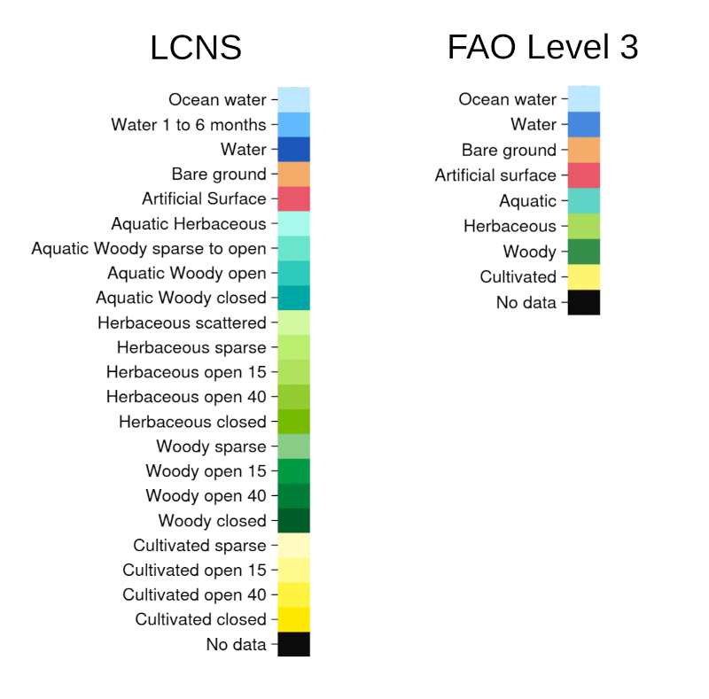

Interactive land cover explorer
===============================

|location_link| (opens in a new window).

.. |location_link| raw:: html

   <a href="_static/land_cover_explorer.html" target="_blank">Open the interactive land cover explorer</a>

The interactive map in the link above shows land cover values across the savanna region of northern Australia.
Using the selector, the depicted land cover can either be the true values or the predictions from the Themeda model.
These values can be shown either for 2019 or 2020 (and 2018, for the true values), and can be visualised either using the LCNS or the FAO Level 3 labelling scheme (see below for the colour scheme legends).
Note that the map can also be made fullscreen by clicking the arrow icon in the top-right corner of the map.

