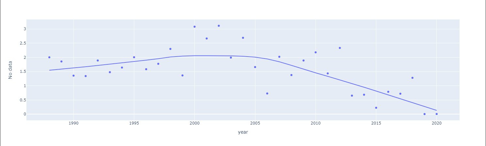
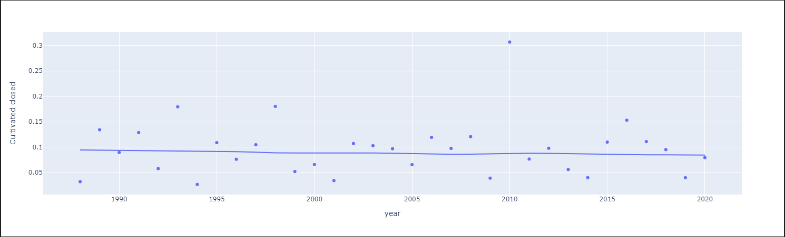
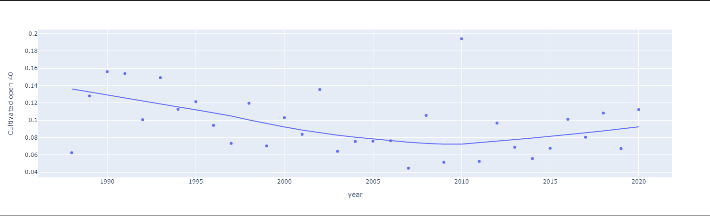
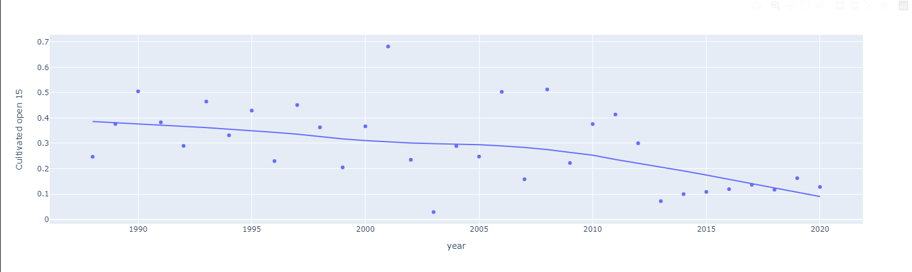
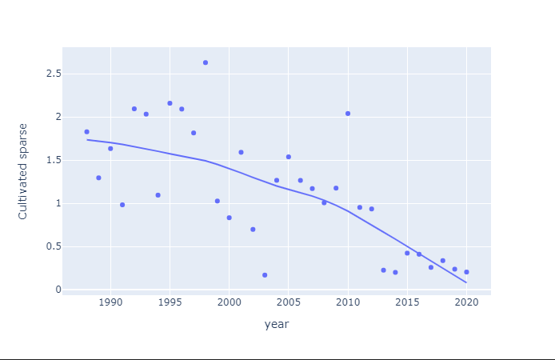
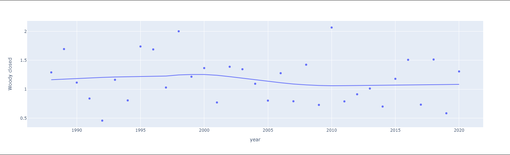
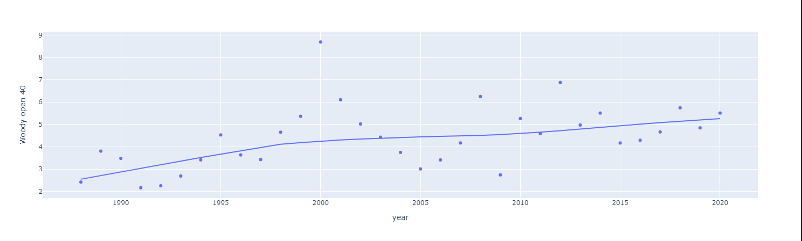
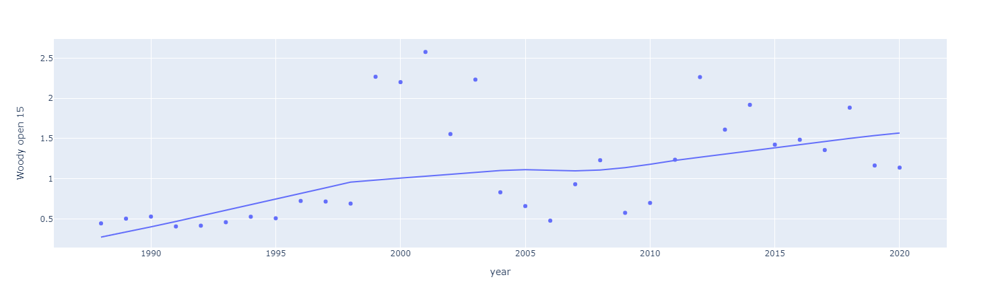
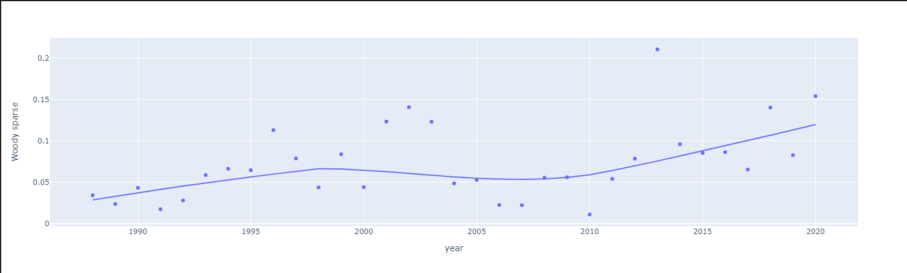
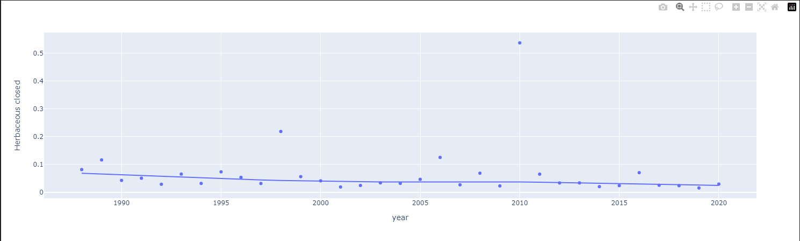

## **Trendline Analysis**

In this analysis, we have explored the trends and patterns of specific categories over time using scatter plots with lowess trendlines. The lowess trendline is a locally weighted scatterplot smoothing technique that helps us understand the general trend within the data by capturing the underlying pattern. By fitting these trendlines to our scatter plots, we can identify potential trends, changes, and patterns in the selected categories.

### <ins>No Data</ins>

Upon analyzing the trendline for the "No Data" category, we observe a noticeable downward trend after 2005. This downward trend suggests a reduction in the occurrence of missing data in the dataset. By the year 2020, the proportion of missing data has decreased to 0%, compared to 1.5% in 2015. This indicates significant improvements in data availability and completeness over time.

It is noteworthy that throughout the analyzed period, the category "No Data" represents a relatively small proportion of the overall dataset. At its peak, the category accounted for only 3% of the total observations. Therefore, the presence of missing data in the dataset does not significantly impact the overall analysis and conclusions drawn from the other categories.

### <ins>Cultivated</ins>

The "Cultivated" category comprises four sub-categories, each exhibiting distinct trends over time. While these sub-categories represent specific variations within cultivated land, none of them have a significant influence on the overall analysis.

1. **Cultivated Closed**: This sub-category shows a consistent and uniform trend, maintaining a low percentage of approximately 0.1% throughout the analyzed period. The maximum value observed is 0.3%. The stability in the trendline suggests a relatively steady presence of cultivated close land without substantial variations. 
   
    

2. **Cultivated Open 40**: Over time, the "Cultivated Open 40" sub-category displays a slight downward trend, with a maximum value of 0.2%. By the year 2020, the percentage of this sub-category decreases to around 0.1%. Although the trend shows a minor decline, it is not significant in terms of its impact on the overall analysis.

    

3. **Cultivated Open 15:** The "Cultivated Open 15" sub-category exhibits a more pronounced downward trend. Starting at 0.4% in 1988, the proportion of this sub-category decreases steadily over the years to reach approximately 0.1% by 2020. This decline indicates a reduction in the presence of cultivated open 15 land.

    

4. **Cultivated Sparse:** The "Cultivated Sparse" sub-category demonstrates a significant downward trend from approximately 2% to consistently close to 0% between 2015 and 2020. This trend suggests a decreasing occurrence of cultivated sparse land over the analyzed period.

    

Overall, the category "Cultivated" and its sub-categories do not exert a substantial influence on the analysis due to their relatively low proportions. However, it is important to consider their trends and patterns in relation to other categories to gain a comprehensive understanding of land cover dynamics.

### <ins>Woody</ins>

The "Woody" category encompasses four sub-categories, each showcasing distinct trends in land cover over the analyzed period. Among these sub-categories, "Woody Open 40" appears to be the most significant in terms of its percentage contribution to the overall land cover.

1. **Woody Closed**: The "Woody Closed" sub-category exhibits a relatively consistent and uniform trend, accounting for approximately 1% of the land cover throughout the analyzed period. This stability suggests a consistent presence of closed woody vegetation in the landscape.

    

2. **Woody Open 40**: Over time, the "Woody Open 40" sub-category displays a significant increasing trend. Starting at around 2% in the initial years, the percentage of this sub-category consistently rises, reaching 5.5% by 2020. Notably, the year 2000 witnessed a peak value of 9% for the woody open 40 land cover, indicating substantial vegetation growth during that period.

    

3. **Woody Open 15**: The "Woody Open 15" sub-category demonstrates a gradual and consistent increasing trend. From 0.5% in 1988, the proportion of this sub-category steadily rises to reach 1.5% by 2020. This upward trend signifies a continuous expansion of woody open 15 land cover over time.

    

4. **Woody Sparse**: In the initial years (1988-2010), the "Woody Sparse" sub-category remains relatively stable, with a mere percentage of 0.05. However, after 2010, there is a discernible increasing trend, with the proportion of woody sparse land cover reaching 0.15% by 2020. This trend indicates a gradual expansion of woody sparse vegetation in the landscape.

    

Overall, the "Woody" category's sub-categories demonstrate various trends in woody vegetation cover. Among them, "Woody Open 40" stands out as the most significant in terms of its increasing percentage contribution to the overall land cover. Understanding these trends provides valuable insights into the dynamics and changes in woody vegetation across the analyzed period.

### <ins>Herbaceous</ins>

The "Herbaceous" category comprises four sub-categories, each displaying distinct trends in land cover over the analyzed period. Overall, the "Herbaceous" category appears to be significant, with several sub-categories exhibiting high percentages and notable fluctuations.

1. **Herbaceous Closed:** The "Herbaceous" category comprises four sub-categories, each displaying distinct trends in land cover over the analyzed period. Overall, the "Herbaceous" category appears to be significant, with several sub-categories exhibiting high percentages and notable fluctuations.

    

2. **Herbaceous Open 40:** The "Herbaceous Open 40" sub-category maintains a relatively stable and significant coverage of about 5% throughout the analyzed period. This suggests a consistent occurrence of open herbaceous vegetation, which contributes significantly to the overall land cover composition.

    

3. **Herbaceous Open 15:** The "Herbaceous Open 15" sub-category exhibits an increasing trend over time. Starting at 25% in the initial years, the proportion of this sub-category steadily rises to reach approximately 32% by 2020. Notably, there is significant variability within this sub-category, with certain years witnessing herbaceous open coverage surpassing 40%. For instance, in 2011, the proportion of herbaceous open land reached almost 46%. These fluctuations indicate variations in the presence of herbaceous open vegetation across different years.

    

4. **Herbaceous Sparse:** The "Herbaceous Sparse" sub-category demonstrates a slight decreasing trend. Beginning at 17% in the earlier years, the percentage of this sub-category gradually declines to approximately 11.5% by 2020. However, similar to the "Herbaceous Open 15" sub-category, there is notable variability within this category as well, with certain years recording proportions close to 25% of herbaceous sparse land cover.

    

Overall, the "Herbaceous" category stands out as a significant component of the land cover composition. Several sub-categories, such as "Herbaceous Open 40" and "Herbaceous Open 15," exhibit substantial percentages, indicating a significant presence of herbaceous vegetation in the landscape. The observed fluctuations within these sub-categories emphasize the dynamic nature of herbaceous land cover over the analyzed period.