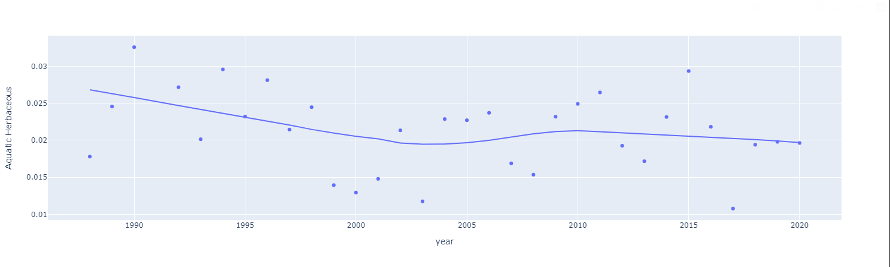

## **Trendline Analysis**

In this analysis, we have explored the trends and patterns of specific land cover classes over time using scatter plots with lowess trendlines. The lowess trendline is a locally weighted scatterplot smoothing technique, helping to visualise general trends over time so that we can identify potential trends, changes, and patterns in the land cover classes and sub-classes.

### <ins>No Data</ins>

Upon analyzing the trendline for the "No Data" category, we observe a noticeable downward trend after 2005. By the year 2020, the proportion of missing data has decreased to 0%, compared to 1.5% in 2015. This indicates significant improvements in data availability and completeness over time.

It is noteworthy that throughout the analyzed period, the category "No Data" represents a relatively small proportion of the overall dataset. At its peak, the category accounted for only 3% of the total observations. Therefore, the presence of missing data in the dataset does not significantly impact the overall analysis and conclusions drawn from the other categories.

### <ins>Cultivated</ins>

The "Cultivated" class represents a very small proportion of the total land area, varying between a peak of c. 2.7% and the 0.3% observed 2015-2020. The majority of cultivated land falls into the 'sparse <4% cover' or 'open' <15% cover' sub-classes, both of which decline over this time period to approximately 0.1% of the total land area by 2015.  

1. **Cultivated Closed**: This sub-class shows a consistently low percentage of approximately 0.1% throughout the analyzed period, without substantial variations. The maximum value observed is 0.3%. 
   
    

2. **Cultivated Open 40**: Over time, the "Cultivated Open 40" sub-class shows a maximum value of 0.2%, and a slight downward trend, declining to around 0.1% by the year 2020. 

    

3. **Cultivated Open 15:** The "Cultivated Open 15" sub-class exhibits a more pronounced downward trend. Starting at 0.4% in 1988, the proportion of this sub-category decreases steadily over the years to reach approximately 0.1% by 2020. This decline indicates a reduction in the presence of cultivated open 15 land.

    

4. **Cultivated Sparse:** The "Cultivated Sparse" sub-class demonstrates a stronger downward trend from approximately 2% to consistently close to 0% between 2015 and 2020. This trend suggests a decreasing occurrence of cultivated sparse land over the analyzed period.

    

Overall, "Cultivated" lands do not exert a substantial influence on the analysis due to their relatively low proportions. However, it is important to consider their trends and patterns in relation to other classes to gain a comprehensive understanding of land cover dynamics.

### <ins>Woody</ins>

The "Woody" class encompasses four sub-classes, from 'closed >65% cover' to 'sparse <4% cover', all of which either remain consistent or increase over the analyzed period, indicating expansion of woody vegetation into previously non-woody areas. The 'Closed' sub-class forms the largest area of woody cover, and consistently accounts for appximately 1% of the total land cover across the region.

1. **Woody Closed**: The "Woody Closed" sub-class (with >65% vegetation cover) consistently accounts for approximately 1% of the land cover throughout the analyzed period. This stability suggests a consistent presence of closed woody vegetation in the wider landscape, even as cover levels may vary through time at individual locations.

    

2. **Woody Open 40**: Over time, the "Woody Open 40" sub-class (with cover percentage 15-40%) displays an increasing trend. Starting at around 2% in the initial years, it rises consistently to reach 5.5% by 2020. Notably, the year 2000 witnessed a peak value of 9%, indicating substantial growth of woody vegetation during that period, mainly as a transition from non-woody classes (rather than simply an increase in cover within already woody areas).

    

3. **Woody Open 15**: The "Woody Open 15" sub-class demonstrates a gradual and consistent increasing trend. From 0.5% in 1988, the proportion of this sub-category steadily rises to reach 1.5% by 2020. 

    

4. **Woody Sparse**: In the initial years (1988-2010), the "Woody Sparse" sub-class (<4% vegetation cover) remains relatively stable at a low 0.05% of total land area. However, after 2010, there is a discernible increasing trend, with the proportion of woody sparse land cover reaching 0.15% by 2020. This trend indicates a gradual expansion of woody sparse vegetation in the landscape.

    

Overall, the "Woody" category's sub-classes demonstrate various trends in woody vegetation cover. Among them, "Woody Open 40" stands out as the most significant in terms of its increasing percentage contribution to the overall land cover. Understanding these trends provides valuable insights into the dynamics and changes in woody and non-woody vegetation across the analyzed period.

### <ins>Herbaceous</ins>

The "Herbaceous" class comprises four sub-classes, from 'Closed >65% cover' to Sparse <4% cover, each displaying distinct trends over the analyzed period. Overall, the "Herbaceous" class is the dominant land cover in this region, and its sub-classes show high percentages and notable fluctuations.

1. **Herbaceous Closed:** Revise text - original sentence repeated the class introduction, rather than discussing the trend line for this sub-class.

    

2. **Herbaceous Open 40:** The "Herbaceous Open 40" sub-class maintains a relatively stable and significant coverage of 5% throughout the analyzed period. 

    

3. **Herbaceous Open 15:** The "Herbaceous Open 15" sub-class exhibits an increasing trend over time, starting at 25% and steadily rising to reach approximately 32% by 2020. Notably, there is substantial variability over time, with coverage exceeding 40% of the land area in some, for example almost 46% in the year 2011.

    

4. **Herbaceous Sparse:** The "Herbaceous Sparse" sub-class demonstrates a slightly decreasing trend. Beginning at 17% in the earlier years, its area declines to approximately 11.5% of the region by 2020. However, similar to the "Herbaceous Open 15" sub-class, there is notable variability across years, and in some years thsi class comprises almost 25% of the region.

    

Overall, the "Herbaceous" class stands out as a significant component of the land cover composition. While classes with higher vegetation cover (>40%) comprised less than 5% of the landscape, the more open sub-classes covered up to 50% of the total land area, and their observed fluctuations emphasize the dynamic nature of herbaceous land cover over the analyzed period.

### <ins>Aquatic</ins>

The "Aquatic" category consists of four sub-categories, each displaying distinct trends in aquatic land cover over the analyzed period. Notably, the "Aquatic" category encompasses sub-categories with varying percentages and significant fluctuations.

1. **Aquatic Woody Closed:** The "Aquatic Woody Closed" sub-category exhibits substantial variations in the trendline, characterized by numerous peaks and troughs. Starting at approximately 15% coverage in 1988, the proportion gradually declines to around 14% by 2020. However, the trendline reveals notable year-to-year changes, with some years surpassing 20% coverage and others dropping to around 12%. For instance, the lowest value of 9% occurred in 2017, while the highest value of 23% was observed in 2018. Given the relatively high percentages and significant variability, the "Aquatic Woody Closed" sub-category emerges as a significant component of the aquatic land cover.

    

2. **Aquatic Woody Open:** The "Aquatic Woody Open" sub-category shows a gradual increasing trend over time. Beginning at around 6% coverage, the proportion steadily rises, reaching approximately 10% by the end of the analyzed period (2020). This upward trend suggests a progressive expansion of woody open vegetation within aquatic areas.

    

3. **Aquatic Woody Sparse to Open:** The "Aquatic Woody Sparse to Open" sub-category displays a relatively low percentage value, starting at 1% and gradually increasing to approximately 2.3% by 2020. Despite the modest coverage, there is a discernible increasing trend for this category, indicating a slight expansion of woody sparse to open land cover within aquatic environments.

    

4. **Aquatic Herbaceous:** The "Aquatic Herbaceous" sub-category exhibits a decreasing trend over the analyzed period. Initially, the coverage remained consistently above 2% during the early and mid-1990s, but it has gradually declined to approximately 2% in recent years. This decreasing trend suggests a decrease in the presence of herbaceous vegetation within aquatic areas.

    

Within the "Aquatic" class, "Aquatic Woody Open" stands out as the most significant sub-class in terms of coverage and trend. Additionally, the "Aquatic Woody Closed" sub-class demonstrates significant fluctuations, contributing to the overall dynamics of aquatic land cover over time.

### <ins>Artificial Surface</ins>

The "Artificial Surface" class represents human infrastructure, settlements, and impervious surfaces, and represents a small but increasing proportion of the land area over the analyzed period.

Until the early 2000s, the coverage of artificial surfaces remained low, and then increased to reach approximately 1% in the year 2000. This reflects the expansion of human settlements and infrastructure, although the overall percentage is still very small compared to other land cover classes.

### <ins>Natural Bare Ground </ins>

The "Natural Bare Ground" class is composed by natural surfaces bare of vegetation, primarily in sandy or stony deserts. This class has a significant coverage of 8.3% at both the start and end of the study period, but demonstrates strong fluctuations over time. Initially, there is a gradual decline in coverage until the mid-2000s, reducing the proportion to under 2%. Subsequently, the trend reverses, leading to a gradual increase and ultimately returning to the original coverage of 8.3% by 2020. This fluctuation primarily involves changes between bare and sparsely vegetated land covers, probably due to variations in rainfall.

    

**Deletion of the 'natural herbaceous sparse' text** I apologise, the DEA-LCNS excel file contained an error only in the name of one category, not in its code.  The Natural Herbaceous sparse and very sparse were categorized as Class 12, Herbaceous sparse, but I left the word 'natural' in the name column by accident, so naturally you thought it was a separate category.
This section only needs to cover "Natural Bare Ground", since Natural Herbaceous Sparse is subsumed into Herbaceous Sparse.
DELETE -  2. **Natural Herbaceous Sparse:** The trendline for the "Natural Herbaceous Sparse" sub-category closely resembles that of the "Natural Bare Ground" category. However, this sub-category exhibits higher coverage throughout the analyzed period. Starting at approximately 15% coverage, there is a gradual decline until the mid-2000s. Subsequently, the trend shifts, leading to a gradual increase, ultimately reaching a coverage of around 15% by 2020. This pattern suggests fluctuations in the presence of sparse herbaceous vegetation within natural areas.

    

### <ins>Water</ins>

The "Water" class encompasses permanent water bodies and seasonal water variations. This category provides insights into the presence and dynamics of water resources within the region.

1. **Water:** The "Water" sub-class represents permanent water bodies such as rivers, lakes, and reservoirs, present for >6 months of the year. This category exhibits a substantial coverage of approximately 20% during the analyzed period from 1988 to 2020. While the overall trendline remains relatively stable, there is a slight increasing trend observed from 2010 onwards. This indicates a gradual expansion of the total area of permanent water bodies over time.

    

2. **Water 1 to 6 months:** The "Water 1 to 6 months" sub-class denotes seasonal water variations, including temporary water bodies or changes in the extent of water bodies during the year. This sub-class varies between approximately 1% to 1.5% coverage throughout the analyzed period.

    

The "Water" category, particularly the sub-category of permanent water bodies, plays a crucial role in land cover comparisons and provides insights into the distribution and changes in water resources over time. With a significant coverage of approximately 20% of the land area, the presence of water bodies has a notable impact on the overall land cover composition.
